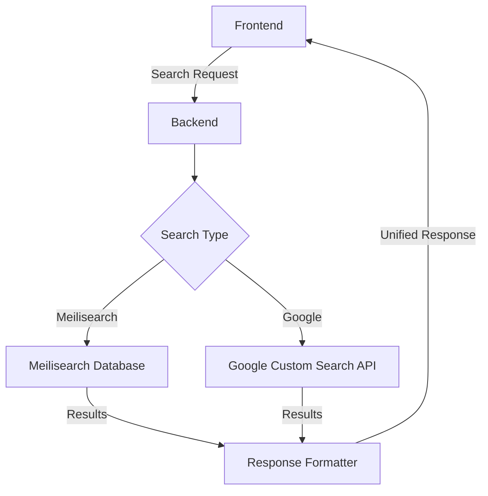
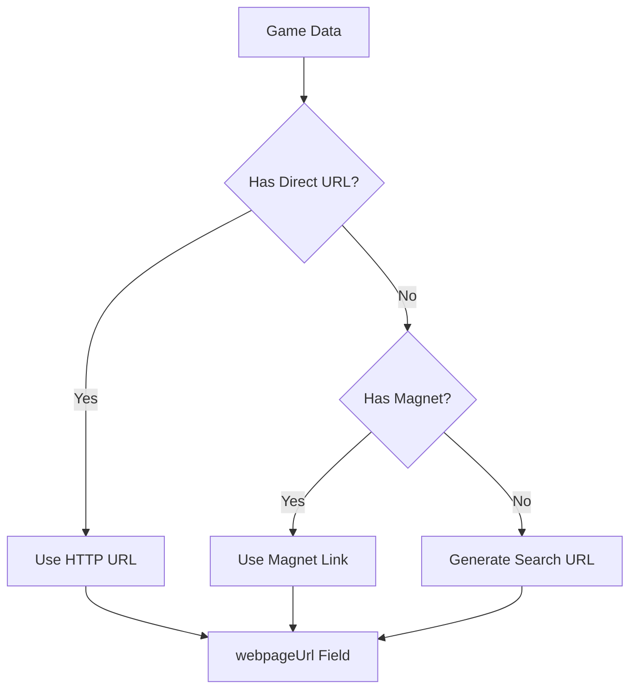

# 🎮 Pirated Games Search Engine

[](https://github.com/Jameschuthink/Pirated_games_search/actions/workflows/ci.yml)

```code
🚀 Hybrid Game Search Engine with Meilisearch + Google Directory API
🤾 Star this repo if you find it useful!
```

## 🌟 Introduction

**Pirated Games Search Engine** is a powerful backend service that provides hybrid search functionality for game repacks. It combines the speed of Meilisearch with the comprehensiveness of Google's Custom Search API to deliver robust search results.

## 🎯 Project Purpose

This project enables users to:

- 🔍 **Search game repacks** from multiple sources (FitGirl, DODI)
- 🌐 **Live search via Google** for up-to-date results
- 🔗 **Get direct source links** with proper attribution
- 🎮 **Find games** by title with typo-tolerant search
- 📊 **Hybrid architecture** combining local database and live API

## 🚀 Key Features

### Hybrid Search System
- **Meilisearch Integration**: Fast, local database search for synced game data
- **Google Directory API**: Live search for comprehensive, up-to-date results
- **Smart Fallback**: Automatic fallback from HTTP URLs → Magnet links → Search URLs

### Game Data Sources
- **FitGirl Repacks**: Popular repack provider with curated games
- **DODI Repacks**: Alternative repack source
- **Google Custom Search**: Live web search for additional results

### API Endpoints
- `GET /games/search` - Search synced games (Meilisearch)
- `GET /games/search/google` - Live search (Google API)
- `POST /games/sync` - Sync database with latest repacks

### Technical Stack
- **Backend**: Express.js with TypeScript
- **Search**: Meilisearch + Google Custom Search API
- **Validation**: Zod for robust data validation
- **Testing**: Vitest with comprehensive test coverage
- **Documentation**: OpenAPI/Swagger UI
- **Security**: Helmet, CORS, Rate Limiting
- **Logging**: Pino for structured logging

## 🛠️ Getting Started

### 🎮 Game Search Setup

#### Step 1: 🚀 Initial Setup

```bash
# Clone the repository
git clone git@github.com:Jameschuthink/Pirated_games_search.git
cd Pirated_games_search

# Install dependencies
pnpm install
```

#### Step 2: ⚙️ Environment Configuration

Copy `.env.template` to `.env` and configure:

```env
# Required for Google Search API
GOOGLE_SEARCH_API_KEY="your_google_api_key"
GOOGLE_SEARCH_CX="your_search_engine_id"

# Meilisearch configuration (optional for local sync)
MEILI_HOST="your_meilisearch_host"
MEILI_API_KEY="your_meilisearch_key"
MEILI_INDEX_NAME="pirated_games"

# CORS and server settings
CORS_ORIGIN="http://localhost:3000,http://localhost:8080"
PORT="8080"
```

#### Step 3: 🏃‍♂️ Running the Project

```bash
# Development mode with auto-reload
pnpm start:dev

# Build for production
pnpm build

# Run in production
NODE_ENV=production pnpm start
```

#### Step 4: 🔍 Testing the API

```bash
# Test Meilisearch endpoint
curl "http://localhost:8080/games/search?q=cyberpunk"

# Test Google search endpoint
curl "http://localhost:8080/games/search/google?q=cyberpunk"

# Sync database (requires Meilisearch)
curl -X POST "http://localhost:8080/games/sync"
```

#### Step 5: 📊 Access API Documentation

- **Swagger UI**: `http://localhost:8080/`
- **OpenAPI JSON**: `http://localhost:8080/swagger.json`

## 🔧 Hybrid Search Architecture

### How It Works



### Data Flow

1. **User Search**: Frontend sends search query to backend
2. **Route Selection**: Backend determines which search system to use
3. **Meilisearch Path**: Fast, local search with typo tolerance
4. **Google Path**: Live web search with comprehensive results
5. **Response Unification**: Both paths return consistent response format
6. **Result Display**: Frontend shows results with source attribution

### Fallback Strategy



### Response Format

Both search systems return the same response structure:

```json
{
  "success": true,
  "message": "Games found",
  "responseObject": [
    {
      "title": "Game Title",
      "webpageUrl": "https://..." || "magnet:?xt=...",
      "source": "FitGirl" || "DODI" || "domain.com",
      "size": "10 GB",  // Meilisearch only
      "uploadDate": "2023-01-15T00:00:00.000Z",  // Meilisearch only
      "snippet": "Game description..."  // Google only
    }
  ],
  "statusCode": 200
}
```

## 🤝 Feedback and Contributions

We'd love to hear your feedback and suggestions for further improvements. Feel free to contribute and join us in making game search better and more comprehensive!

🎮 Happy gaming!
